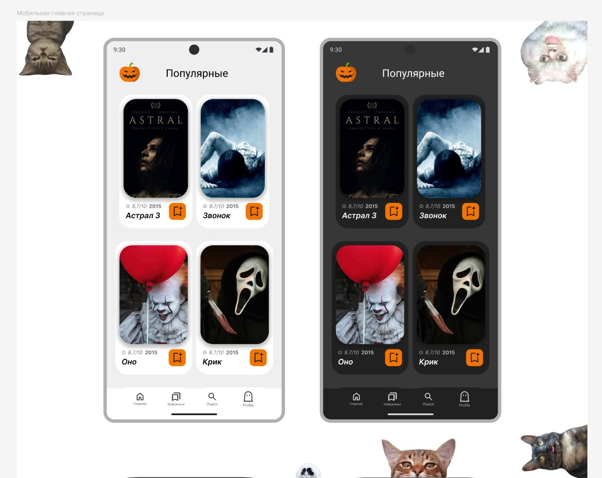
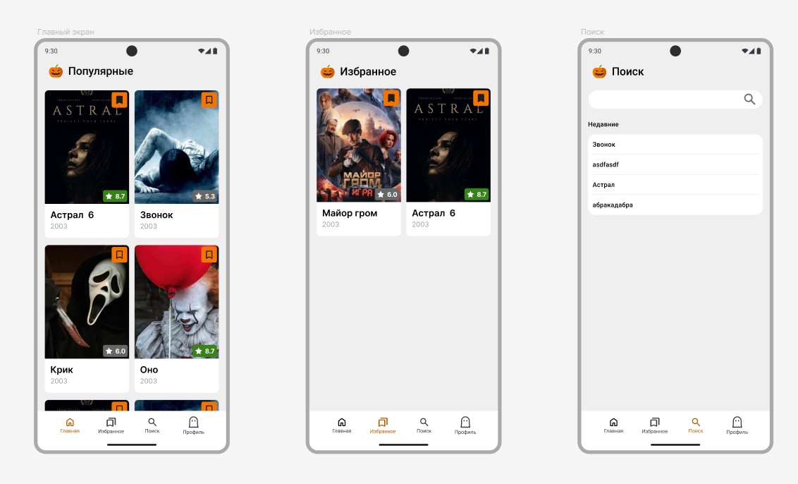
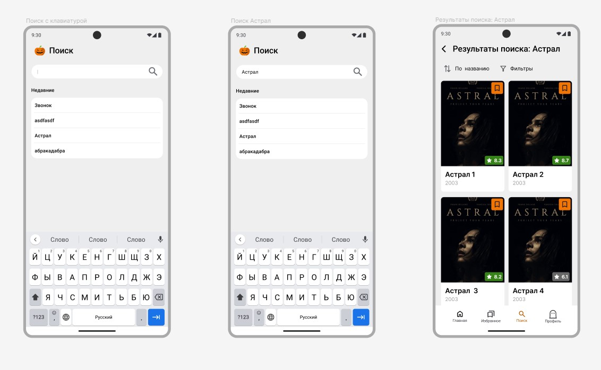
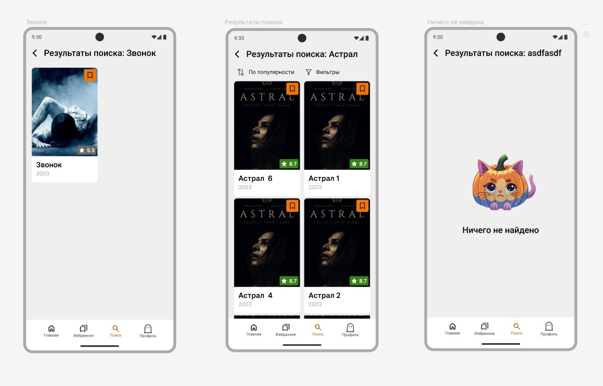
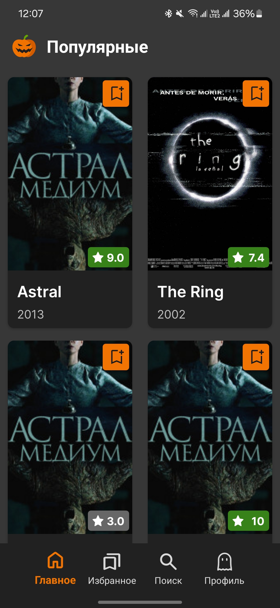
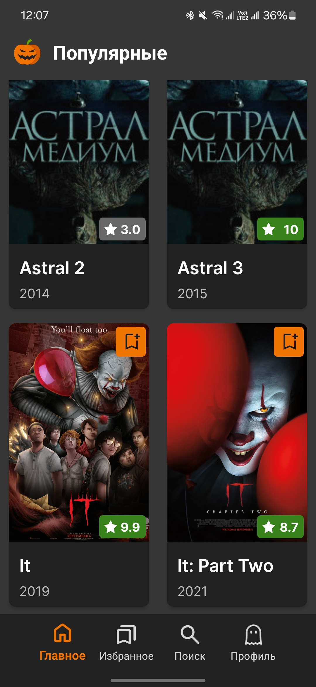
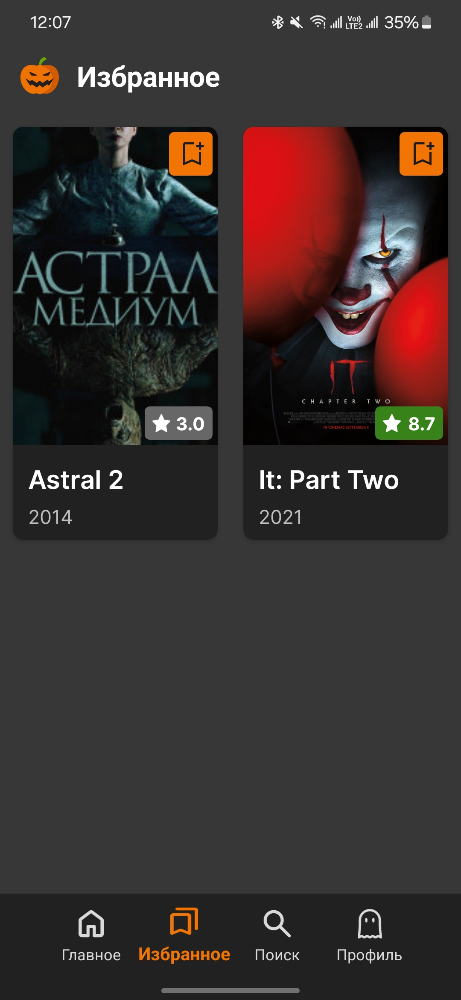
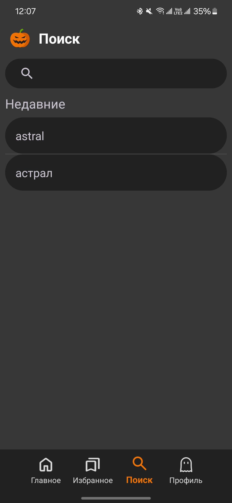

# Домашнее задание по Kotlin lev1 №1

## Содержание

- [Задание](#задание)
- [Технологии](#технологии)
- [Реализация в Figma](#реализация-в-figma)
- [Результат выполнения](#результат-выполнения)
- [Установка](#установка)


## Задание:

Из домашнего задания по интерфейсам, требуется реализовать минимум 2 экрана.
Для наполнения экрана требуется использовать собственные объекты с данными, которые потом мапятся на поля верстки.
Если нет ДЗ по интерфейсам, то необходимо придумать экраны 
1й со списком ячеек, например еды с названием, описанием  и картинкой)
2й отдельная страница с подробной информацией
добавлена навигация для переходов
Возможно релизована навигация дополнительно через bottomNavigation, табы 
Данные можно маппить из api или создать отдельный файл моковых данных, который симулирует ответы сервера (обязательно асинхронно со слипом в 500мс)


**Ограничения и требования**
1. Требуется использовать Fragment или Compose View.
2. Приложение не должно содержать хардкод.
3. Приложение должно использовать ресурсы(resources) для работы
4. В коде можно оставлять комментарии, но в конечной версии нельзя оставлять Log
5. Между реализованными экранами должны быть переходы, или любой другой способ попасть на эти экраны после запуска приложения.
6. Данные экранов нельзя зашивать в верстке, они должны мапиться в верстку при помощи объектов с данными
7. Данные поставляться на экраны должны через не-синхронные вызовы, и задержка для получения данных должна быть в 2 секунды и иметь возможность ее увеличить (в коде).
8. Экраны или блоки с данными, должны поддерживать состояние загрузки.

**Что будет плюсом**

1. Поддержка состояния ошибки всеми экранами и блоками
2. Поддержка пустого состояния блоками с данными и экранами
3. Реализация больше трех экранов
4. Использование API для получения данных для экранов.


## Технологии

- Kotlin
- View
- ImageView
- ConstraintLayout
- AndroidX
- ViewModel
- FloatState
- RecyclerView
- DiffUtils
- Glide
- Retrofit2


## Реализация в Figma





## Результат выполнения
Продемострировано на реальном Android-устройсте Samsung Galaxy S22








## Установка

### Для установки на android
1. Клонируйте репозиторий:
   ```bash
   git clone https://github.com/IvanCRA/HomeWorkViewsTP2.git
   ``` 
   Если клонировали ранее, то не нужно.
2. Откройте проект в Android Studio.
3. Подождите пока Android Studio доустанавливает необходимые зависимости.
4. Синхронизируйте проект с Gradle(Sync Now).